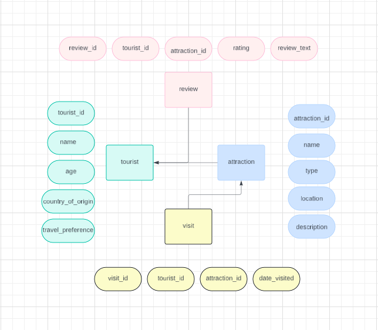

# Wild Atlantic Way Feedback Hub

A SQL-based database system designed to collect and analyse tourist reviews along Ireland's Wild Atlantic Way, providing actionable insights to enhance visitor experiences.

---

## Table of Contents
1. [About the Project](#about-the-project)  
2. [Project Prompt](#project-prompt) 
3. [Database Schema](#database-schema) 
4. [Technologies Used](#technologies-used)  
5. [How to Run](#how-to-run)  
6. [Features](#features)  
7. [Queries](#queries)  
8. [Codd’s Rules Demonstration](#codds-rules-demonstration)
9. [License](#license)

---

## About the Project  

This project aims to build a database system for collecting and analysing tourist reviews along Ireland’s Wild Atlantic Way. The system stores tourist information, attraction details, reviews, and visits, enabling the tourism board to enhance services and experiences.

---

## Project Prompt

The Wild Atlantic Way, stretching along Ireland's breathtaking coastline, is a prime destination for travellers seeking picturesque landscapes and cultural experiences. In an effort to enhance visitor satisfaction and improve the attractions along the route, a local tourism board decides to create an interactive platform for collecting and analysing tourist reviews. This platform is intended to provide real-time feedback from tourists, allowing for dynamic improvements and personalisation of the tourist experience. The goal is to build a comprehensive repository of tourist interactions that can help stakeholders tailor services and attractions more efficiently. To efficiently manage the influx of data, the tourism board sets up a database named "Wild Atlantic Way Feedback Hub".

The system is designed to capture detailed reviews, rating scores, and personal anecdotes from tourists who have explored various segments of the route. This system allows for a structured way to collect and understand the preferences and expectations of visitors, which are crucial for continuous enhancement of the routes offerings. At the heart of the Feedback Hub is the Review entity, which includes attributes such as ReviewId, TouristID. This entity is key in capturing the tourists direct feedback on specific attractions or their overall journey along the Wild Atlantic Way. Each review provides valuable insights into what is working well and what might need improvement. 

The Tourist entity stores personal information about the visitor who provide feedback, including TouristID, Name, Age, Country of Origin, and Travel Preferences. This data helps segmenting the feedback to understand different demographics need and desires better, enabling more targeted marketing and service adjustments. Additionally, knowing the travel preferences allows the tourism board to suggest personalised future visits based on past enjoyment patters. 

The Attraction entity details each notable point along the Wild Atlantic Way, such as AttractionID, Name, Type (e.g. natural, historical, cultural), Location, and Description. This entity helps link each review to a specific location, making it easier to analyse data and implement specific improvements. Thought the Wild Atlantic Way Feedback Hub, the tourism board aims to create a dynamic and responsive tourism experience, enriching the journey for future visitors and boosting the global appeal of Ireland's stunning coastal route. Using this information, create an ERD model looking at tables, relationships, primary keys and foreign keys. Use entities: Tourist, Attraction, Review, Visit, but add more if necessary.

---

## Database Schema  

### a. Tables 
**tourist:**  stores tourist information.  
**attraction:**  stores points of interest along the Wild Atlantic Way.  
**review:** stores tourists feedback.  
**visit:**  stores specific attraction visit by tourists.

### b. Attributes
**tourist**  (tourist_id, name, age, country_of_origin, travel_preferences)  
**attraction** (attraction_id, name, type, location, description)  
**review**  (review_id, tourist_id, attraction_id, rating, review_text)  
**visit**  (visit_id, tourist_id, attraction_id, date_visited)

### c. Primary Keys
**tourist:** tourist_id PK  
**attraction:** attraction_id PK  
**review:**  review_id PK  
**visit:**  visit_id PK

### d. Foreign Keys
**tourist:** n/a  
**attraction:** n/a  
**review:** tourist_id FK, attraction_id FK  
**visit:**  tourist_id FK, attraction_id FK

### ERD Diagram

### ER Model

  

### Assumptions

• Tourist can write many Reviews, but each review is written by exactly one Tourist.  
• An Attraction can receive many Reviews, but each review is written exactly for one
Attraction.  
• A Tourist can visit many Attractions, and an Attraction can be visited by many
Tourists.  
• An Attraction can be visited by many Tourists, but each Visit refers to only one
Attraction.

---

## Technologies Used  

• **SQL** for database creation and queries.  
• **MySQL Workbench** as the database management system.  
• **ERD Design Tool** to create the data diagram and model Lucidchart was used.

---

## How to Run

To set up the project and database locally:

1. Install MySQL on your machine.
2. Clone the repository:
    
    git clone https://github.com/yourusername/Wild-Atlantic-Way-Feedback-Hub.git

3. Navigate to the project directory:

    cd Wild-Atlantic-Way-Feedback-Hub

4. Import the provided SQL file (e.g., database_schema.sql) into your MySQL database:

    mysql -u username -p < database_schema.sql

5. The database and tables will be set up, and you can begin adding data or running queries.

---

## Features

**Tourist Information Management:** Collects and stores data about tourists (e.g., name, age, travel preferences).  
**Attraction Tracking:**  Allows storing and categorizing details about each attraction.  
**Review System:**  Tourists can leave reviews for each attraction they visit, including ratings and comments.  
**Visit Logs:** Tracks each tourist's visit to the attractions along the Wild Atlantic Way.  
**Analytics and Reporting:**  Generate queries to analyse tourist preferences and attraction performance (e.g., average ratings, most-visited attractions).

---

## Queries

The project includes several SQL queries for:

**Selecting data:** Retrieve information on tourists, reviews, and visits.  
**Inserting test data:** Add sample tourists, attractions, reviews, and visit records.  
**Updating records:** Modify tourist details or review ratings.  
**Deleting records:** Remove specific data entries.

To run the queries, you can use MySQL Workbench or the MySQL command line interface.

---

## Codd’s Rules Demonstration

In this project, several of Codd’s Rules are demonstrated through SQL queries that illustrate how the relational database is designed and operates. The following rules are applied to the Wild Atlantic Way Feedback Hub database:
 

**Rule 2: Guaranteed Access**

Description: Every value in the database must be accessible by a combination of table name, primary key, and attribute name.

SELECT country_of_origin FROM tourist WHERE tourist_id = 1;
 

**Rule 4: Active Online Catalog Rule**

Description: The database system must provide an active online catalog, allowing users to query the metadata about the schema (such as tables and columns).

SELECT table_name, column_name, data_type FROM information_schema.columns  
WHERE table_schema = 'Wild_Atlantic_Way_Feedback_Hub' AND table_name IN ('Tourist', 'Attraction', 'Review', 'Visit');
 

**Rule 5: The Comprehensive Data Sublanguage Rule**

Description: The database system must support a comprehensive data sublanguage for defining, manipulating, and controlling data.

SELECT COUNT(*) AS num_travelers FROM visit  
WHERE date_visited = '2024-04-22';
 

**Rule 7: High Level Insert Update Delete Rule**

Description: The database system must support high-level operations for inserting, updating, and deleting data.

UPDATE tourist  
SET travel_preferences = 'Adventure'  
WHERE country_of_origin IN ('USA', 'Canada');  
INSERT INTO tourist (name, age, country_of_origin, travel_preferences) VALUES ('John Smith', 35, 'USA', 'Adventure'),
('Emma Johnson', 28, 'Canada', 'Nature');

---

## License

This project is licensed under the MIT License - see the LICENSE file for details.

---
